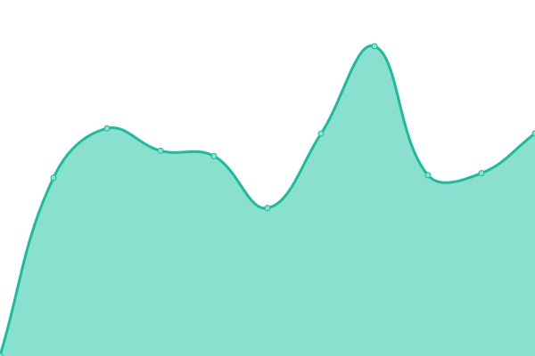
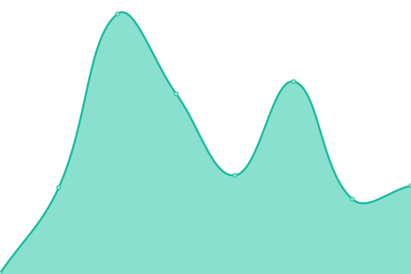
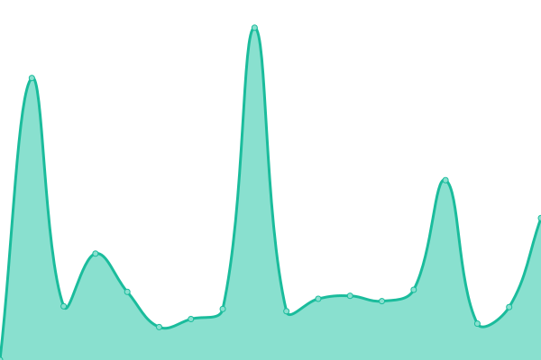
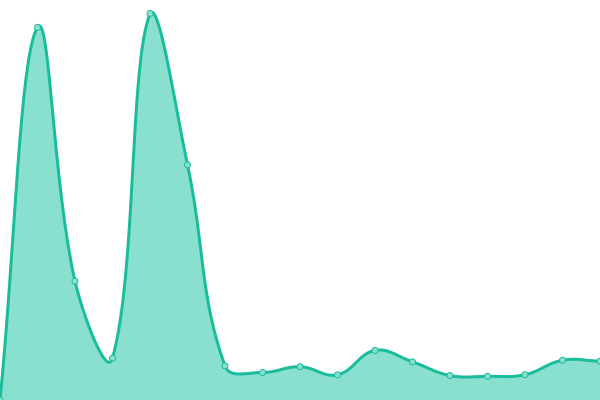
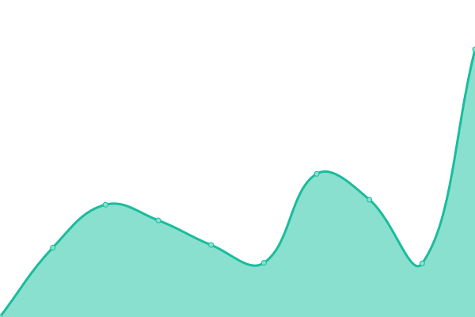

# [📈 Live Status](https://vlastikyoutubeko.github.io/fictional-memory): <!--live status--> **🟧 Partial outage**

This repository contains the open-source uptime monitor and status page for [vlastikyoutubeko](https://vlastikyoutubeko.github.io/fictional-memory), powered by [Upptime](https://github.com/upptime/upptime).

With [Upptime](https://upptime.js.org), you can get your own unlimited and free uptime monitor and status page, powered entirely by a GitHub repository. We use [Issues](https://github.com/vlastikyoutubeko/fictional-memory/issues) as incident reports, [Actions](https://github.com/vlastikyoutubeko/fictional-memory/actions) as uptime monitors, and [Pages](https://vlastikyoutubeko.github.io/fictional-memory) for the status page.

<!--start: status pages-->
<!-- This summary is generated by Upptime (https://github.com/upptime/upptime) -->
<!-- Do not edit this manually, your changes will be overwritten -->
<!-- prettier-ignore -->
| URL | Status | History | Response Time | Uptime |
| --- | ------ | ------- | ------------- | ------ |
|  [Radio](https://radio.plainrock127.xyz/phonk) | 🟩 Up | [radio.yml](https://github.com/VlastikYoutubeKo/fictional-memory/commits/HEAD/history/radio.yml) | 

 1108ms
     
 | 

<a href="https://vlastikyoutubeko.github.io/fictional-memory/history/radio">95.63%</a>
    

|  [Radio - Homepage](https://phonk.plainrock127.xyz) | 🟩 Up | [radio-homepage.yml](https://github.com/VlastikYoutubeKo/fictional-memory/commits/HEAD/history/radio-homepage.yml) | 

 917ms
     
 | 

<a href="https://vlastikyoutubeko.github.io/fictional-memory/history/radio-homepage">99.85%</a>
    

|  [Wordpress](http://plainrockfm.wz.cz) | 🟩 Up | [wordpress.yml](https://github.com/VlastikYoutubeKo/fictional-memory/commits/HEAD/history/wordpress.yml) | 

 2329ms
     
 | 

<a href="https://vlastikyoutubeko.github.io/fictional-memory/history/wordpress">100.00%</a>
    

|  [Odjezdy.online](https://odjezdy.online) | 🟩 Up | [odjezdy-online.yml](https://github.com/VlastikYoutubeKo/fictional-memory/commits/HEAD/history/odjezdy-online.yml) | 

 696ms
     
 | 

<a href="https://vlastikyoutubeko.github.io/fictional-memory/history/odjezdy-online">100.00%</a>
    

|  [DelayTracker - ČD Most](https://most.odjezdy.online) | 🟥 Down | [delay-tracker-cd-most.yml](https://github.com/VlastikYoutubeKo/fictional-memory/commits/HEAD/history/delay-tracker-cd-most.yml) | 

 2026ms
     
 | 

<a href="https://vlastikyoutubeko.github.io/fictional-memory/history/delay-tracker-cd-most">66.72%</a>
    

|  [DelayTracker - ČD Bílina](https://bilina.odjezdy.online) | 🟥 Down | [delay-tracker-cd-bilina.yml](https://github.com/VlastikYoutubeKo/fictional-memory/commits/HEAD/history/delay-tracker-cd-bilina.yml) | 

 1198ms
     
 | 

<a href="https://vlastikyoutubeko.github.io/fictional-memory/history/delay-tracker-cd-bilina">73.72%</a>
    

|  [Domácí server 1](https://amz.odjezdy.online) | 🟥 Down | [domaci-server-1.yml](https://github.com/VlastikYoutubeKo/fictional-memory/commits/HEAD/history/domaci-server-1.yml) | 

 2861ms
     
 | 

<a href="https://vlastikyoutubeko.github.io/fictional-memory/history/domaci-server-1">88.47%</a>
    

<!--end: status pages-->

[**Visit our status website →**](https://vlastikyoutubeko.github.io/fictional-memory)

## 📄 License

- Powered by: [Upptime](https://github.com/upptime/upptime)
- Code: [MIT](./LICENSE) © [vlastikyoutubeko](https://vlastikyoutubeko.github.io/fictional-memory)
- Data in the `./history` directory: [Open Database License](https://opendatacommons.org/licenses/odbl/1-0/)
